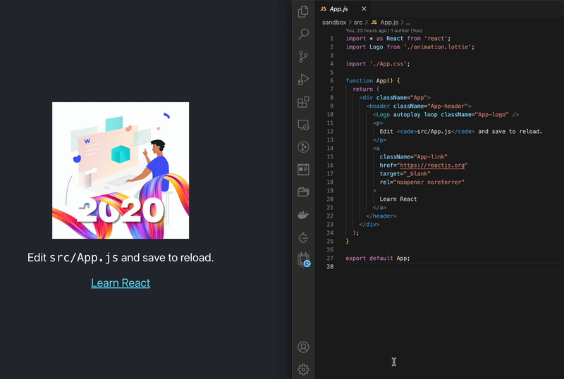

# dotlottie-loader

Webpack loader for dotlottie animations



## Usage

```js
// webpack.config
module.exports = {
  module: {
    rules: [
      {
        test: /.lottie$/,
        type: 'javascript/auto',
        use: 'dotlottie-loader',
      },
    ],
  },
};
```

```jsx
// AwesomeAnimation.jsx
import React from 'react';
import Animation from './my-module.lottie';

export default () => <Animation />;
```

## Development

```sh
yarn start
yarn sandbox
```
